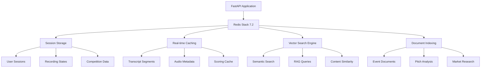

# PitchScoop

[](https://www.python.org/downloads/)
[](https://fastapi.tiangolo.com/)
[](https://modelcontextprotocol.io/)
[](https://www.docker.com/)
[](https://redis.io/)
[](https://opensource.org/licenses/MIT)

**MCP-First AI-Powered Pitch Competition Platform**

A modern, cloud-native platform built around **Model Context Protocol (MCP)** for AI-assisted pitch competition management. Features real-time speech-to-text, automated AI scoring, and comprehensive analytics - all accessible through **32+ standardized MCP tools** for seamless AI assistant integration.

## 🏆 Key Features

- **🎤 Real-time Speech-to-Text**: Gladia API integration with WebSocket streaming
- **🧠 AI-Powered Scoring**: Multi-dimensional pitch analysis using Azure OpenAI
- **📊 Live Leaderboards**: Real-time rankings and analytics
- **🔌 MCP-First Architecture**: 32 standardized tools for AI assistant integration
- **📁 Domain-Driven Design**: Clean separation of concerns across 8 business domains
- **☁️ Cloud-Native**: Containerized with Redis, MinIO, and vector storage
- **🚀 Production-Ready**: Health checks, monitoring, and comprehensive testing

## 🔗 MCP Architecture Overview

PitchScoop is built **MCP-first**, meaning every business function is exposed as a standardized Model Context Protocol tool. This enables AI assistants (Claude, GPT, etc.) to seamlessly interact with the platform through a unified interface.

## 🚀 Quick Start (New Team Members)

**One-command setup** - Get up and running in under 2 minutes:

```bash
git clone <repository-url>
cd pitchscoop
./setup.sh
```

That's it! The script will:
- ✅ Validate Docker is installed and running
- ✅ Copy environment template to `.env`
- ✅ Build and start all services (FastAPI, Redis, MinIO, Qdrant)
- ✅ Run health checks to verify everything is working
- ✅ Show you all the important URLs and commands

### Manual Setup (if you prefer)

```bash
cp .env.example .env
docker compose up --build
```

### Verify Setup

```bash
# Test API health
curl localhost:8000/api/healthz
# Should return: {"ok": true}
```

**Key URLs:**
- 🌐 **API**: http://localhost:8000
- 📚 **API Docs**: http://localhost:8000/docs
- 🗄️ **MinIO Console**: http://localhost:9001 (`pitchscoop` / `pitchscoop123`)
- 🔴 **RedisInsight**: http://localhost:8001 (Vector search monitoring)

## 🔧 Development Workflow

```bash
# Start services in background
docker compose up -d --build

# View API logs
docker compose logs -f api

# Run tests
docker compose exec api pytest tests/

# Stop services
docker compose down
```

### MCP Tool Domains


## 🏗️ Technical Architecture

### Core Technology Stack

| Layer | Technology | Purpose |
|-------|------------|----------|
| **API Framework** | FastAPI 0.115+ | High-performance async API with OpenAPI specs |
| **MCP Integration** | MCP 1.0.0 | Model Context Protocol for AI assistant integration |
| **Speech-to-Text** | Gladia API | Real-time WebSocket transcription |
| **AI Analysis** | Azure OpenAI GPT-4 | Multi-dimensional pitch scoring and feedback |
| **Caching & Sessions** | Redis Stack 7.2 | Session storage, vector search, real-time data |
| **Object Storage** | MinIO | Audio file storage with presigned URLs |
| **Vector Search** | RedisVL | Document embeddings and semantic search |
| **Containerization** | Docker Compose | Multi-service orchestration |
| **Language** | Python 3.11+ | Type-safe with Pydantic models |

### Infrastructure Services

```yaml
Services:
  api:          # FastAPI application (Port 8000)
  redis:        # Redis Stack with vector search (Port 6379, 8001)
  minio:        # S3-compatible storage (Ports 9000, 9001)
```

## 🔴 Redis Stack & Vector Search

**PitchScoop leverages Redis Stack 7.2 as a multi-purpose data platform**, combining traditional caching, session management, and advanced vector search capabilities for AI-powered features.

### Redis Architecture Overview



### Core Redis Capabilities

| Feature | Implementation | Use Case |
|---------|----------------|----------|
| **Session Management** | Redis Hash + TTL | User authentication, recording sessions |
| **Real-time Caching** | Redis Strings/Lists | Transcript segments, leaderboard data |
| **Vector Search** | RediSearch + VSS | Semantic document search, content similarity |
| **Document Indexing** | RedisVL + LlamaIndex | RAG-powered pitch analysis and feedback |
| **Pub/Sub Messaging** | Redis Streams | Real-time updates, WebSocket broadcasting |
| **Leaderboard Rankings** | Redis Sorted Sets | Live competition rankings with scores |

### RedisVL Integration

**RedisVL (Redis Vector Library)** powers PitchScoop's advanced document processing and semantic search capabilities:

#### Vector Store Configuration

```python
# Redis Vector Service Integration
from llama_index.vector_stores.redis import RedisVectorStore
from redis.commands.search.field import VectorField, TextField

# Vector index schema for pitch documents
schema = [
    VectorField(
        "embedding",
        "FLAT",
        {
            "TYPE": "FLOAT32",
            "DIM": 1536,  # OpenAI ada-002 embedding size
            "DISTANCE_METRIC": "COSINE"
        }
    ),
    TextField("content"),      # Document text content
    TextField("event_id"),     # Competition identifier
    TextField("document_type"), # pitch_transcript, market_research, etc.
    NumericField("created_at")  # Timestamp indexing
]
```

#### Document Processing Pipeline

1. **Embedding Generation**: Azure OpenAI text-embedding-ada-002 model
2. **Vector Storage**: Redis FLAT index with cosine similarity
3. **Semantic Search**: Multi-field queries with metadata filtering
4. **RAG Integration**: LlamaIndex + RedisVL for contextual responses

### Production Redis Setup

#### Docker Configuration

```yaml
redis:
  image: redis/redis-stack:7.2.0-v9
  ports:
    - "6379:6379"    # Redis Protocol
    - "8001:8001"    # RedisInsight Dashboard
  environment:
    - REDIS_ARGS="--appendonly yes --save 900 1"
  volumes:
    - redis-data:/data
```

#### Key Features Enabled

- **RediSearch**: Full-text and vector search
- **RedisJSON**: Document storage with JSON operations
- **RedisGraph**: Relationship modeling (future feature)
- **RedisTimeSeries**: Time-based analytics
- **RedisInsight**: Web-based management dashboard

### Vector Search Use Cases

#### 1. Semantic Pitch Analysis

```python
# Find similar pitches across competitions
results = await redis_vector_service.query_index(
    event_id="hackathon-2024",
    document_type="pitch_transcript",
    query="AI-powered fintech solution for small businesses",
    top_k=5
)
```

#### 2. Market Research Integration

```python
# Index market research documents
await redis_vector_service.index_documents(
    event_id="vc-pitch-series",
    document_type="market_research",
    documents=[market_analysis_doc, competitor_analysis_doc]
)
```

#### 3. Contextual Feedback Generation

```python
# Generate personalized feedback using RAG
feedback = await feedback_service.generate_contextual_feedback(
    session_id="session_123",
    context_query="presentation delivery best practices"
)
```

### Performance Characteristics

| Metric | Redis Stack Performance |
|--------|-------------------------|
| **Vector Search Latency** | < 50ms for 10k documents |
| **Embedding Dimension** | 1536 (OpenAI ada-002) |
| **Index Type** | FLAT (exact search) |
| **Memory Usage** | ~6MB per 10k documents |
| **Concurrent Queries** | 1000+ queries/second |
| **Storage Efficiency** | Compressed vectors + metadata |

### Development & Monitoring

#### RedisInsight Dashboard

Access the Redis management interface at `http://localhost:8001` to:

- **Monitor Performance**: Query latency, memory usage, connection stats
- **Inspect Indexes**: Vector index schema and document counts
- **Debug Queries**: Test vector searches and analyze results
- **Manage Data**: Browse keys, examine document content

#### Vector Index Management

```python
# Create event-specific vector index
await redis_vector_service.ensure_index_exists(
    event_id="demo-event",
    document_type="pitch_analysis"
)

# Query index statistics
info = redis_client.ft("idx:event_demo_pitch_analysis").info()
print(f"Documents indexed: {info['num_docs']}")
print(f"Index size: {info['index_size_mb']} MB")
```

### Scaling Considerations

#### Horizontal Scaling
- **Redis Cluster**: Shard vector indexes across multiple nodes
- **Read Replicas**: Distribute query load for high-availability
- **Index Partitioning**: Separate indexes per event/competition

#### Performance Optimization
- **Batch Indexing**: Process multiple documents simultaneously
- **Lazy Loading**: Create indexes on-demand for active events
- **TTL Management**: Auto-expire old competition data
- **Memory Optimization**: Compress embeddings for storage efficiency

### Domain-Driven Architecture

PitchScoop follows Domain-Driven Design (DDD) principles with 8 distinct business domains, each exposing MCP tools:

```
api/
├── domains/
│   ├── events/           # ✅ Competition lifecycle management
│   │   ├── entities/     # Event, Participant domain models
│   │   ├── mcp/          # events.* MCP tools
│   │   └── handlers/     # Business logic implementation
│   ├── recordings/       # ✅ Audio capture & speech-to-text
│   │   ├── mcp/          # pitches.* MCP tools
│   │   ├── repositories/ # Gladia API, MinIO storage
│   │   └── value_objects/# Transcript, AudioFile models
│   ├── scoring/          # ✅ AI-powered pitch analysis
│   │   ├── mcp/          # analysis.* MCP tools
│   │   └── handlers/     # Azure OpenAI integration
│   ├── leaderboards/     # ✅ Real-time rankings
│   │   ├── mcp/          # leaderboard.* MCP tools
│   │   └── services/     # Ranking algorithms
│   ├── users/            # ✅ Participant management
│   │   └── mcp/          # users.* MCP tools
│   ├── market/           # 🚧 Market intelligence analysis
│   │   └── mcp/          # market.* MCP tools
│   ├── feedback/         # 🚧 Personalized coaching
│   │   └── mcp/          # feedback.* MCP tools
│   └── indexing/         # 🚧 Document processing & RAG
│       └── mcp/          # indexing.* MCP tools
├── mcp_server.py         # Standalone MCP server
└── main.py               # FastAPI + MCP integration
```

### Event-Driven Workflow

1. **Event Creation** → `events.create_event` → Competition setup
2. **Participant Registration** → `users.register_participant` → Team enrollment  
3. **Audio Recording** → `pitches.start_recording` → Real-time STT
4. **AI Analysis** → `analysis.score_pitch` → Multi-dimensional scoring
5. **Leaderboard Update** → `leaderboard.update_rankings` → Live rankings
6. **Feedback Generation** → `feedback.generate_report` → Personalized insights

## 🔧 MCP Tools Reference

PitchScoop exposes **32 standardized MCP tools** across 8 business domains. Each tool follows OpenAPI specifications with comprehensive input validation.

### 🏗️ Events Domain (`events.*`)

| Tool | Purpose | Key Parameters |
|------|---------|----------------|
| `events.create_event` | Initialize competition | `event_type`, `judges`, `sponsor_tools` |
| `events.list_events` | Browse competitions | `status`, `organizer_id` |
| `events.get_event_details` | Fetch event metadata | `event_id` |
| `events.join_event` | Register participants | `event_id`, `participant_info` |
| `events.start_event` | Begin competition | `event_id` |
| `events.end_event` | Finalize and lock scoring | `event_id` |

### 🎤 Recordings Domain (`pitches.*`)

| Tool | Purpose | Key Parameters |
|------|---------|----------------|
| `pitches.start_recording` | Initialize WebSocket STT session | `event_id`, `team_name`, `audio_config` |
| `pitches.stop_recording` | Upload audio + finalize transcript | `session_id`, `audio_data_base64` |
| `pitches.get_session` | Retrieve session + transcript data | `session_id` |
| `pitches.get_playback_url` | Generate presigned audio URLs | `session_id`, `expires_hours` |
| `pitches.list_sessions` | Browse recordings with filters | `event_id`, `team_name`, `status` |
| `pitches.delete_session` | Remove audio + session data | `session_id` |

### 🧠 Scoring Domain (`analysis.*`)

| Tool | Purpose | Key Parameters |
|------|---------|----------------|
| `analysis.score_pitch` | Complete multi-dimensional analysis | `session_id`, `event_id`, `criteria_weights` |
| `analysis.score_idea` | Evaluate innovation + market fit | `session_id`, `focus_areas` |
| `analysis.score_technical` | Assess implementation sophistication | `session_id`, `technical_criteria` |
| `analysis.score_presentation` | Analyze delivery + communication | `session_id`, `include_audio_metrics` |
| `analysis.get_scoring_results` | Retrieve detailed scoring breakdown | `session_id` |

### 🏆 Leaderboards Domain (`leaderboard.*`)

| Tool | Purpose | Key Parameters |
|------|---------|----------------|
| `leaderboard.get_rankings` | Fetch live competition rankings | `event_id`, `limit`, `include_details` |
| `leaderboard.get_team_rank` | Individual team position | `event_id`, `session_id` |
| `leaderboard.get_stats` | Competition statistics | `event_id` |

### 👥 Users Domain (`users.*`)

| Tool | Purpose | Key Parameters |
|------|---------|----------------|
| `users.register_participant` | Add team/individual | `event_id`, `participant_data` |
| `users.get_participant` | Fetch participant profile | `participant_id` |
| `users.update_role` | Modify permissions | `user_id`, `role` |

### 📈 Advanced Domains (In Development)

- **Market Analysis** (`market.*`) - Competitive intelligence and market research
- **Feedback Generation** (`feedback.*`) - Personalized coaching recommendations  
- **Document Indexing** (`indexing.*`) - RAG-powered document processing

## 🚀 Production Features

### Real-Time Audio Processing
- **WebSocket STT**: Gladia API integration with sub-second latency
- **Multi-format Support**: WebM, WAV, MP3, OGG audio processing
- **Automatic Transcription**: Real-time speech-to-text with confidence scoring
- **Audio Storage**: MinIO with presigned URL generation (configurable expiry)

### AI-Powered Analysis
- **Multi-dimensional Scoring**: 4 core criteria (Idea, Technical, Tools, Presentation)
- **Contextual Understanding**: Competition-specific analysis (hackathon vs VC pitch)
- **Confidence Metrics**: AI uncertainty quantification for reliable scoring
- **Batch Processing**: Efficient analysis of multiple pitches simultaneously

### Enterprise-Grade Infrastructure
- **Health Monitoring**: Comprehensive health checks and metrics
- **Horizontal Scaling**: Stateless design with Redis session management
- **Data Persistence**: Redis + MinIO with configurable retention policies
- **Security**: API key management and rate limiting

## 🔌 API Integration

### MCP Server Integration

```python
# Connect to PitchScoop MCP server
from mcp import Client

client = Client("docker compose exec -T api python mcp_server.py")

# Start recording a pitch
result = await client.call_tool("pitches.start_recording", {
    "event_id": "hackathon-2024",
    "team_name": "AI Innovators",
    "pitch_title": "Smart Contract Analyzer"
})

session_id = result["session_id"]
websocket_url = result["websocket_url"]
```

### REST API Access

```bash
# Health check
curl http://localhost:8000/api/healthz

# List all MCP tools
curl http://localhost:8000/mcp/tools

# Execute MCP tool via REST
curl -X POST http://localhost:8000/mcp/execute \
  -H "Content-Type: application/json" \
  -d '{
    "tool": "events.create_event",
    "arguments": {
      "event_type": "hackathon",
      "judges": ["judge1", "judge2"]
    }
  }'
```

### Claude Desktop Integration

```json
{
  "mcpServers": {
    "pitchscoop": {
      "command": "docker",
      "args": [
        "compose", "-f", "/path/to/pitchscoop/docker-compose.yml",
        "exec", "-T", "api", "python", "mcp_server.py"
      ]
    }
  }
}
```

## 📚 Technical Documentation

Comprehensive documentation is available in the [`/docs`](./docs) directory:

| Document | Purpose |
|----------|----------|
| **[ONBOARDING.md](./docs/ONBOARDING.md)** | New developer setup guide |
| **[WARP.md](./docs/WARP.md)** | Architecture patterns & conventions |
| **[MCP_BUSINESS_CASE.md](./docs/MCP_BUSINESS_CASE.md)** | Strategic positioning for MCP adoption |
| **[IMPLEMENTATION_ROADMAP.md](./docs/IMPLEMENTATION_ROADMAP.md)** | Development milestones & priorities |
| **[GLADIA_AUDIO_INTELLIGENCE_ANALYSIS.md](./docs/GLADIA_AUDIO_INTELLIGENCE_ANALYSIS.md)** | STT integration analysis |

## 🛍️ Development & Deployment

### Quick Start
```bash
git clone <repository-url>
cd pitchscoop
./setup.sh  # One-command setup
```

### Development Workflow
```bash
# Start services
docker compose up -d --build

# Run tests
docker compose exec api pytest tests/ -v

# View logs
docker compose logs -f api

# Clean restart
docker compose down -v && docker compose up --build
```

### Production Deployment
```bash
# Environment configuration
cp .env.example .env
# Configure: AZURE_OPENAI_*, GLADIA_API_KEY, BRIGHT_DATA_API_KEY

# Production build
docker compose -f docker-compose.prod.yml up -d
```

### Key URLs
- **API**: http://localhost:8000
- **API Documentation**: http://localhost:8000/docs  
- **MinIO Console**: http://localhost:9001 (`pitchscoop`/`pitchscoop123`)
- **RedisInsight**: http://localhost:8001

---

**📧 Questions?** Check [`docs/WARP.md`](./docs/WARP.md) for architecture details or open an issue.
