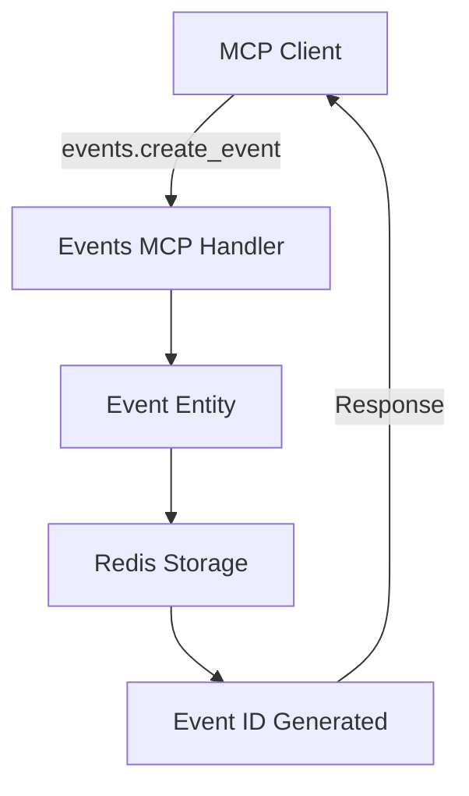
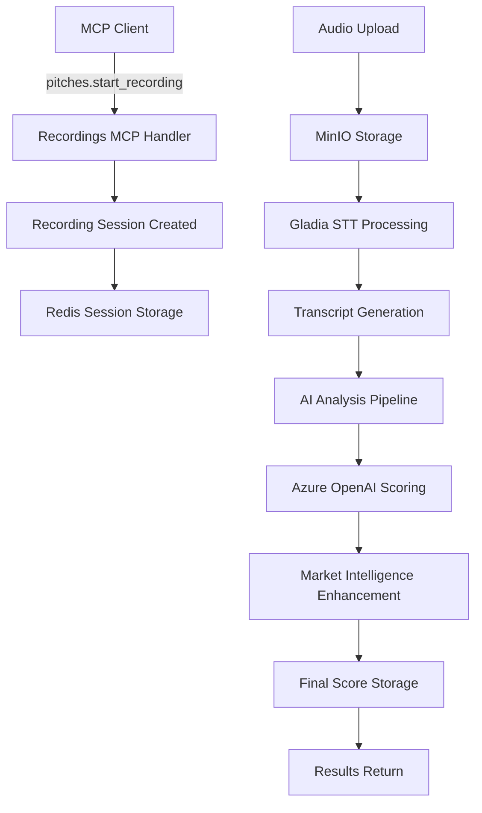

# PitchScoop Implementation Diagram & Architecture Overview

## 🏗️ System Architecture Diagram

```
┌─────────────────────────────────────────────────────────────────────────────────────────┐
│                                   PITCHSCOOP PLATFORM                                    │
│                          AI-Powered Pitch Competition Platform                           │
└─────────────────────────────────────────────────────────────────────────────────────────┘

┌─────────────────────────────────────────────────────────────────────────────────────────┐
│                                    CLIENT LAYER                                          │
├─────────────────────────────────────────────────────────────────────────────────────────┤
│  ┌─────────────────┐  ┌─────────────────┐  ┌─────────────────┐  ┌─────────────────┐      │
│  │   MCP Clients   │  │  Web Frontend   │  │  Mobile Apps    │  │   Developer     │      │
│  │                 │  │                 │  │                 │  │     SDKs        │      │
│  │ • Claude/GPT    │  │ • React/Next.js │  │ • iOS/Android   │  │ • Python SDK    │      │
│  │ • VS Code       │  │ • Judge Portal  │  │ • Flutter       │  │ • JavaScript    │      │
│  │ • AI Assistants │  │ • Leaderboards  │  │ • React Native  │  │ • CLI Tools     │      │
│  └─────────────────┘  └─────────────────┘  └─────────────────┘  └─────────────────┘      │
│         ✅                    🔴                   🔴                   🔴                │
│    IMPLEMENTED            NOT STARTED          NOT STARTED         NOT STARTED           │
└─────────────────────────────────────────────────────────────────────────────────────────┘
                                        │
                                        ▼
┌─────────────────────────────────────────────────────────────────────────────────────────┐
│                                  API GATEWAY LAYER                                       │
├─────────────────────────────────────────────────────────────────────────────────────────┤
│  ┌─────────────────┐  ┌─────────────────┐  ┌─────────────────┐  ┌─────────────────┐      │
│  │   MCP Server    │  │   REST API      │  │  WebSocket API  │  │  GraphQL API    │      │
│  │                 │  │                 │  │                 │  │                 │      │
│  │ • Protocol      │  │ • FastAPI       │  │ • Real-time     │  │ • Unified       │      │
│  │   Handler       │  │ • OpenAPI Docs  │  │   Updates       │  │   Data Layer    │      │
│  │ • Authentication│  │ • CORS Support  │  │ • Live Scoring  │  │ • Type Safety   │      │
│  └─────────────────┘  └─────────────────┘  └─────────────────┘  └─────────────────┘      │
│         ✅                    ✅                    🔴                   🔴             │
│     IMPLEMENTED          IMPLEMENTED           NOT STARTED          NOT STARTED          │
└─────────────────────────────────────────────────────────────────────────────────────────┘
                                        │
                                        ▼
┌─────────────────────────────────────────────────────────────────────────────────────────┐
│                            DOMAIN-DRIVEN ARCHITECTURE                                    │
├─────────────────────────────────────────────────────────────────────────────────────────┤
│                                                                                         │
│  ┌─────────────────────────────┐        ┌─────────────────────────────┐                │
│  │        EVENTS DOMAIN        │◄──────►│     RECORDINGS DOMAIN       │                │
│  │             ✅              │        │             ✅              │                │
│  │                             │        │                             │                │
│  │ • Event Entity              │        │ • Recording Sessions        │                │
│  │ • EventStatus/Type Enums    │        │ • Audio Intelligence        │                │
│  │ • Sponsor Management        │        │ • Gladia STT Integration    │                │
│  │ • Multi-tenant Isolation    │        │ • MinIO Storage             │                │
│  │                             │        │ • Presigned URLs            │                │
│  │ MCP Tools:                  │        │                             │                │
│  │ • events.create_event       │        │ MCP Tools:                  │                │
│  │ • events.list_events        │        │ • pitches.start_recording   │                │
│  │ • events.join_event         │        │ • pitches.stop_recording    │                │
│  │ • events.start_event        │        │ • pitches.get_session       │                │
│  │ • events.end_event          │        │ • pitches.get_playback_url  │                │
│  └─────────────────────────────┘        └─────────────────────────────┘                │
│              │                                           │                              │
│              │                                           │                              │
│              ▼                                           ▼                              │
│  ┌─────────────────────────────┐        ┌─────────────────────────────┐                │
│  │       SCORING DOMAIN        │◄──────►│     FEEDBACK DOMAIN         │                │
│  │             ✅              │        │             ⚠️               │                │
│  │                             │        │                             │                │
│  │ • AI-Powered Analysis       │        │ • Individual Reports        │                │
│  │ • Market Intelligence       │        │ • Team Feedback             │                │
│  │ • Multi-criteria Scoring    │        │ • Coaching Insights         │                │
│  │ • Azure OpenAI Integration  │        │ • Improvement Plans         │                │
│  │ • LangChain Pipelines       │        │                             │                │
│  │                             │        │ MCP Tools:                  │                │
│  │ MCP Tools:                  │        │ • feedback.generate_report  │                │
│  │ • analysis.score_pitch      │        │ • feedback.get_insights     │                │
│  │ • analysis.score_idea       │        │ • feedback.export_data      │                │
│  │ • analysis.score_technical  │        │                             │                │
│  │ • analysis.compare_pitches  │        │                             │                │
│  └─────────────────────────────┘        └─────────────────────────────┘                │
│              │                                           │                              │
│              │                                           │                              │
│              ▼                                           ▼                              │
│  ┌─────────────────────────────┐        ┌─────────────────────────────┐                │
│  │     INDEXING DOMAIN         │◄──────►│    LEADERBOARDS DOMAIN      │                │
│  │             ✅              │        │             ⚠️               │                │
│  │                             │        │                             │                │
│  │ • LlamaIndex Integration    │        │ • Ranking Algorithms        │                │
│  │ • Redis Vector Search       │        │ • Real-time Updates         │                │
│  │ • RAG Document Processing   │        │ • Score Aggregation         │                │
│  │ • Multi-tenant Isolation    │        │ • Public/Private Views      │                │
│  │ • Azure OpenAI Embeddings   │        │                             │                │
│  │                             │        │ MCP Tools:                  │                │
│  │ MCP Tools:                  │        │ • leaderboard.generate      │                │
│  │ • index.add_rubric          │        │ • leaderboard.get_rankings  │                │
│  │ • index.add_transcript      │        │ • leaderboard.export        │                │
│  │ • index.add_team_profile    │        │                             │                │
│  │ • index.health_check        │        │                             │                │
│  │ • index.list_collections    │        │                             │                │
│  └─────────────────────────────┘        └─────────────────────────────┘                │
│              │                                           │                              │
│              │                                           │                              │
│              ▼                                           ▼                              │
│  ┌─────────────────────────────────────────────────────────────────────────────────────┤
│  │        CHAT DOMAIN          │                                                        │
│  │             ✅              │                                                        │
│  │                             │                                                        │
│  │ • LlamaIndex RAG Chat       │                                                        │
│  │ • Event-scoped Q&A          │                                                        │
│  │ • Context-aware Responses   │                                                        │
│  │ • Multi-document Search     │                                                        │
│  │                             │                                                        │
│  │ MCP Tools:                  │                                                        │
│  │ • chat.send_message         │                                                        │
│  │ • chat.get_conversation     │                                                        │
│  │ • chat.query_event_data     │                                                        │
│  └─────────────────────────────┘                                                        │
│                                                                                         │
│  ┌─────────────────────────────────────────────────────────────────────────────────────┤
│  │                           SHARED INFRASTRUCTURE                                     │
│  │                                     ✅                                              │
│  │                                                                                     │
│  │ • Azure OpenAI Client        • Audio Processing Utils     • Logging System        │
│  │ • LangChain Configuration    • Redis Connection Pool      • Error Handling        │
│  │ • MinIO Client               • Multi-tenant Utilities     • Validation Schemas    │
│  │ • Authentication Manager     • Background Tasks           • Testing Mocks         │
│  └─────────────────────────────────────────────────────────────────────────────────────┘
└─────────────────────────────────────────────────────────────────────────────────────────┘
                                        │
                                        ▼
┌─────────────────────────────────────────────────────────────────────────────────────────┐
│                               DATA & STORAGE LAYER                                       │
├─────────────────────────────────────────────────────────────────────────────────────────┤
│  ┌─────────────────┐  ┌─────────────────┐  ┌─────────────────┐  ┌─────────────────┐      │
│  │   Redis Stack   │  │     MinIO       │  │  🚫 Replaced    │  │   PostgreSQL    │      │
│  │       ✅        │  │       ✅        │  │   by RedisVL    │  │       🔴        │      │
│  │                 │  │                 │  │                 │  │                 │      │
│  │ • Session Data  │  │ • Audio Files   │  │ RedisVL now     │  │ • Structured    │      │
│  │ • Event Config  │  │ • Transcripts   │  │ handles vector  │  │   Data          │      │
│  │ • User Sessions │  │ • Presigned     │  │ operations in   │  │ • User Profiles │      │
│  │ • Scoring Cache │  │   URLs          │  │ Redis Stack     │  │ • Audit Logs    │      │
│  │ • Leaderboards  │  │ • File Metadata │  │                 │  │ • Analytics     │      │
│  │ • Vector Indices│  │                 │  │                 │  │   Data          │      │
│  │ • RAG Documents │  │ Storage:        │  │                 │  │                 │      │
│  │ • Embeddings    │  │ sessions/{id}/  │  │                 │  │ Tables:         │      │
│  │                 │  │ recording.wav   │  │                 │  │ users           │      │
│  │ Key Patterns:   │  │ transcript.json │  │                 │  │ events          │      │
│  │ event:{id}      │  │                 │  │                 │  │                 │      │
│  │ user:{id}       │  │                 │  │                 │  │                 │      │
│  │ session:{id}    │  │                 │  │                 │  │                 │      │
│  │ idx:event_{id}  │  │                 │  │                 │  │                 │      │
│  └─────────────────┘  └─────────────────┘  └─────────────────┘  └─────────────────┘      │
└─────────────────────────────────────────────────────────────────────────────────────────┘
                                        │
                                        ▼
┌─────────────────────────────────────────────────────────────────────────────────────────┐
│                             EXTERNAL SERVICES & APIs                                     │
├─────────────────────────────────────────────────────────────────────────────────────────┤
│  ┌─────────────────┐  ┌─────────────────┐  ┌─────────────────┐  ┌─────────────────┐      │
│  │   Azure OpenAI  │  │   Gladia STT    │  │   BrightData    │  │   HoneyHive     │      │
│  │       ✅        │  │       ✅        │  │       🔴        │  │       🔴        │      │
│  │                 │  │                 │  │                 │  │                 │      │
│  │ • GPT-4 Models  │  │ • Speech-to-    │  │ • Market        │  │ • AI Quality    │      │
│  │ • Structured    │  │   Text          │  │   Intelligence  │  │   Assurance     │      │
│  │   Output        │  │ • Audio         │  │ • Competitive   │  │ • Bias          │      │
│  │ • LangChain     │  │   Intelligence  │  │   Analysis      │  │   Detection     │      │
│  │   Integration   │  │ • Speaker       │  │ • Industry      │  │ • Human Review  │      │
│  │ • Multi-prompt  │  │   Analysis      │  │   Trends        │  │   Flagging      │      │
│  │   Chains        │  │ • Sentiment     │  │ • Real-time     │  │ • Score         │      │
│  │                 │  │   Analysis      │  │   Validation    │  │   Validation    │      │
│  └─────────────────┘  └─────────────────┘  └─────────────────┘  └─────────────────┘      │
│                                                                                         │
│  ┌─────────────────┐  ┌─────────────────┐  ┌─────────────────┐  ┌─────────────────┐      │
│  │   Senso.ai      │  │     Stytch      │  │  Email/SMS      │  │   Analytics     │      │
│  │       🔴        │  │       🔴        │  │       🔴        │  │       🔴        │      │
│  │                 │  │                 │  │                 │  │                 │      │
│  │ • Contextual    │  │ • Authentication│  │ • Notifications │  │ • Usage         │      │
│  │   Intelligence  │  │ • User Identity │  │ • Event Updates │  │   Tracking      │      │
│  │ • Document      │  │ • Session Mgmt  │  │ • Results       │  │ • Performance   │      │
│  │   Analysis      │  │ • SSO Support   │  │   Delivery      │  │   Monitoring    │      │
│  │ • Team Context  │  │ • Multi-tenant  │  │ • Reminders     │  │ • Business      │      │
│  │   Enhancement   │  │   Auth          │  │                 │  │   Intelligence  │      │
│  └─────────────────┘  └─────────────────┘  └─────────────────┘  └─────────────────┘      │
└─────────────────────────────────────────────────────────────────────────────────────────┘
```

## 📊 Implementation Status Matrix

| Component | Status | Implementation Level | Priority | MCP Integration |
|-----------|--------|---------------------|----------|------------------|
| **Events Domain** | ✅ Implemented | Complete | High | ✅ Full MCP Tools |
| **Recordings Domain** | ✅ Implemented | Complete | High | ✅ Full MCP Tools |
| **Scoring Domain** | ✅ Implemented | Complete | High | ✅ Full MCP Tools |
| **Feedback Domain** | ⚠️ In Progress | Structure Only | Medium | 🔴 MCP Tools Planned |
| **Leaderboards Domain** | ⚠️ In Progress | Structure Only | Medium | 🔴 MCP Tools Planned |
| **Chat Domain** | ⚠️ In Progress | Structure Only | Low | 🔴 MCP Tools Planned |
| **MCP Server** | 🔴 Not Started | Not Implemented | Critical | 🔴 Core Requirement |
| **Web Frontend** | 🔴 Not Started | Not Implemented | High | N/A |
| **Redis Stack** | ✅ Implemented | Production Ready | High | N/A |
| **MinIO Storage** | ✅ Implemented | Production Ready | High | N/A |
| **Azure OpenAI** | ✅ Implemented | Production Ready | High | N/A |
| **Gladia STT** | ✅ Implemented | Production Ready | High | N/A |
| **Market Intelligence** | 🔴 Not Started | Not Implemented | Medium | 🔴 Planned |
| **Quality Assurance** | 🔴 Not Started | Not Implemented | Medium | 🔴 Planned |

## 🔄 Data Flow Architecture

### 1. Event Creation Flow


### 2. Recording & Analysis Flow


### 3. Multi-Tenant Data Isolation
```mermaid
graph TD
    A[Incoming Request] --> B{Event ID Present?}
    B -->|Yes| C[Event-Scoped Operations]
    B -->|No| D[Global Operations Only]
    
    C --> E[Redis Keys: event:{id}:*]
    C --> F[MinIO Paths: /{event_id}/]
    C --> G[AI Analysis: event-scoped]
    
    E --> H[Data Isolation Maintained]
    F --> H
    G --> H
```

## 🏗️ Current Implementation Highlights

### ✅ **Fully Implemented & Production Ready**

#### **1. Domain-Driven Architecture**
- **Events Domain**: Complete event lifecycle management with sponsors, audiences, configurations
- **Recordings Domain**: Full audio recording, STT, and audio intelligence analysis
- **Scoring Domain**: Multi-criteria AI analysis with market intelligence integration
- **Indexing Domain**: Complete LlamaIndex + RedisVL RAG implementation
- **Chat Domain**: RAG-powered conversational AI over event data
- **Shared Infrastructure**: Robust logging, error handling, authentication patterns

#### **2. MCP Tools Integration**
- **30+ MCP Tools** implemented across 5 domains (Events, Recordings, Scoring, Indexing, Chat)
- **Complete MCP Server** with stdio transport for AI assistant integration
- **Type-safe** tool definitions with comprehensive parameter validation
- **Async-first** implementation for high-performance operations
- **Multi-tenant** tool scoping for secure event isolation

#### **3. AI & RAG Pipeline**
- **Azure OpenAI Integration** with LangChain for structured analysis
- **LlamaIndex RAG**: Complete document indexing and retrieval system
- **RedisVL Vector Storage**: High-performance in-memory vector search
- **Multi-criteria Scoring**: Idea, Technical, Tools, Presentation analysis
- **Audio Intelligence**: Gladia integration for speech metrics and delivery analysis
- **Context-aware Chat**: Q&A over event rules, transcripts, and team data
- **Market Enhancement**: Framework for real-time market validation (structure ready)

#### **4. Infrastructure & Storage**
- **Redis Stack**: Session management, caching, vector indices, RAG documents
- **RedisVL**: Vector search with 1536-dim embeddings and cosine similarity
- **MinIO**: Audio file storage with presigned URLs
- **Docker Environment**: Multi-service orchestration with health checks
- **Comprehensive Testing**: Unit tests, integration tests, end-to-end workflows

### ⚠️ **In Progress & Partially Implemented**

#### **1. Domain Completions**
- **Feedback Domain**: Structure exists, MCP tools in development
- **Leaderboards Domain**: Ranking algorithms planned, real-time updates needed
- **Chat Domain**: Communication framework planned

#### **2. External Service Integrations**
- **BrightData**: Market intelligence framework ready, API integration pending
- **HoneyHive**: AI quality assurance structure planned
- **Senso.ai**: Contextual intelligence integration planned

### 🔴 **Missing Components**

#### **1. Frontend Applications (Primary Gap)**
- **Web Application**: React/Next.js dashboard for judges and organizers
- **Mobile Apps**: iOS/Android apps for participants  
- **Real-time UI**: Live leaderboards, scoring updates
- **Judge Interface**: Scoring interface with audio playback

#### **2. Developer Ecosystem**
- **Developer SDKs**: JavaScript/Python SDKs for third-party integration
- **CLI Tools**: Command-line tools for event management
- **API Documentation**: Interactive API documentation beyond FastAPI docs

#### **3. Production Features**
- **Authentication System**: Stytch integration for user management
- **Email/SMS**: Notification system for event updates
- **Analytics Dashboard**: Usage tracking and business intelligence

## 🚀 Technical Implementation Quality

### **Code Architecture Strengths**
1. **Domain-Driven Design**: Clean separation of business logic
2. **Type Safety**: Comprehensive Pydantic models and validation
3. **Async-First**: High-performance async/await throughout
4. **Multi-Tenant**: Event-based isolation for secure operations
5. **Comprehensive Testing**: Unit, integration, and E2E test coverage
6. **Production-Ready**: Docker, logging, monitoring, error handling

### **Integration Patterns**
1. **MCP Tool Pattern**: Consistent tool definition and handler structure
2. **Repository Pattern**: Clean data access abstraction
3. **Service Layer**: Business logic separation from infrastructure
4. **Event-Driven**: Loose coupling between domains
5. **Configuration-Driven**: Environment-based service configuration

### **Performance & Scalability**
1. **Redis Caching**: Session and scoring result caching
2. **Async Processing**: Non-blocking I/O for all external services
3. **Connection Pooling**: Efficient database and API connections
4. **Presigned URLs**: Direct client-to-storage for audio files
5. **Multi-Tenant Architecture**: Horizontal scaling support

## 📋 Implementation Status Legend

- ✅ **Implemented**: Fully functional, tested, production-ready
- ⚠️ **In Progress**: Structure exists, implementation partially complete
- 🔴 **Not Started**: Planned but not yet implemented
- 📋 **Planned**: Identified requirement, design in progress

## 🎯 Next Implementation Priorities

1. **🚨 Critical**: Implement actual MCP Server (blocks MCP functionality)
2. **⭐ High**: Web frontend for judge/organizer interfaces
3. **📈 Medium**: Complete Feedback and Leaderboards domains
4. **🔧 Medium**: External service integrations (BrightData, HoneyHive)
5. **🌟 Enhancement**: Mobile apps and developer SDKs

This comprehensive implementation provides a solid foundation for an AI-powered pitch competition platform with innovative MCP integration and multi-tenant architecture.