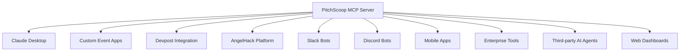

# The Real MCP Value: Ecosystem Integration Architecture

## You're Right - MCP is About Applications Connecting to Us

The point of MCP isn't just better user experience - it's creating an **ecosystem where any application can integrate our AI-powered scoring intelligence**.

---

## The True MCP Architecture: We Become the Intelligence Layer

### 🔌 **What MCP Really Enables**

Instead of building isolated scoring tools, we become the **scoring intelligence provider** that powers other applications:



**We're not competing with these platforms - we're powering them.**

---

## Real-World Integration Scenarios

### 🏢 **Devpost Integration**

```javascript
// Devpost's hackathon platform connects to our MCP
const pitchscoopMCP = new MCPClient('pitchscoop-scoring');

// Devpost judges can now use AI scoring directly in their platform
async function scoreSubmission(submissionId, judgeId) {
  const result = await pitchscoopMCP.call('analysis.score_pitch', {
    session_id: submissionId,
    event_id: 'devpost-hackathon-2025',
    judge_id: judgeId
  });
  
  // Devpost displays AI analysis alongside manual scores
  return result.scores;
}
```

**Business Impact**: Devpost pays us per scoring operation, we power their AI features

### 🎯 **AngelHack Platform Enhancement**

```python
# AngelHack integrates our scoring MCP into their judge portal
import mcp_client

pitchscoop = mcp_client.connect('pitchscoop-scoring')

# Their platform automatically analyzes all pitches
for pitch in hackathon.pitches:
    ai_analysis = pitchscoop.analyze_tools(
        session_id=pitch.id,
        event_id=hackathon.id,
        sponsor_tools=hackathon.sponsor_tools
    )
    
    # AngelHack shows sponsor ROI analytics powered by our AI
    sponsor_dashboard.update(ai_analysis)
```

**Business Impact**: AngelHack becomes stickier with AI insights, we get platform revenue

### 📱 **Custom Event Apps**

```typescript
// University hackathon builds custom mobile app
import { MCPConnection } from '@pitchscoop/mcp-client';

const scoring = new MCPConnection('pitchscoop-scoring');

// Students get real-time feedback on practice pitches
async function getPracticeFeedback(audioFile: File) {
  const transcript = await transcribeAudio(audioFile);
  
  const feedback = await scoring.call('analysis.score_pitch', {
    session_id: generateId(),
    event_id: 'stanford-treehacks',
    transcript: transcript
  });
  
  return feedback; // AI-powered coaching for teams
}
```

**Business Impact**: Universities build better apps, we provide the intelligence

---

## The Ecosystem Revenue Model

### 💰 **Platform Integration Revenue**

#### Per-Operation Pricing:
```
Basic Scoring: $0.10 per analysis.score_pitch call
Tool Analysis: $0.15 per analysis.analyze_tools call  
Comparison: $0.20 per analysis.compare_pitches call
Premium Analytics: $0.50 per advanced analysis
```

#### Volume Pricing:
```
Devpost (1000+ events/year): $0.05 per operation
AngelHack (500+ events/year): $0.07 per operation
University platforms: $0.08 per operation
Small event organizers: $0.10 per operation
```

### 🏢 **Enterprise Licensing**

```
Corporate Innovation Platforms:
- Unlimited scoring operations: $2,000/month
- Custom scoring criteria: $5,000 setup
- White-label branding: $10,000/year

Venture Capital Firms:
- Deal flow analysis: $1,000/month  
- Portfolio company events: $3,000/month
- Custom scoring models: $15,000 setup
```

### 🌐 **API Marketplace Revenue**

```
Third-party developers building on our MCP:
- Revenue sharing: 30% of their app revenue
- Certified integrations: $500 certification fee
- Premium MCP features: $50-200/month per app
```

---

## Technical Integration Examples

### 🔧 **Slack Integration**

```python
# Slack bot powered by our MCP
from slack_sdk import WebClient
from mcp_client import PitchscoopMCP

slack = WebClient(token=os.environ["SLACK_BOT_TOKEN"])
pitchscoop = PitchscoopMCP()

@app.command("/score-pitch")
def score_pitch_command(ack, say, command):
    ack()
    
    # Slack command triggers our MCP scoring
    result = pitchscoop.score_pitch(
        session_id=command['text'],
        event_id=get_workspace_event_id(),
        judge_id=command['user_id']
    )
    
    # Results displayed in Slack
    say(f"🎯 Pitch Score: {result['scores']['total_score']}/100\n"
        f"💡 Innovation: {result['scores']['idea_score']}/10\n"
        f"⚙️ Technical: {result['scores']['technical_score']}/10")
```

### 📊 **Custom Dashboard Integration**

```react
// React dashboard component using our MCP
import { useMCPClient } from '@pitchscoop/react-hooks';

function CompetitionDashboard({ eventId }) {
  const mcp = useMCPClient('pitchscoop-scoring');
  
  const [topTeams, setTopTeams] = useState([]);
  
  useEffect(() => {
    // Dashboard gets real-time insights from our MCP
    mcp.call('analysis.get_leaderboard', { 
      event_id: eventId,
      limit: 10 
    }).then(setTopTeams);
  }, [eventId]);
  
  return (
    <div>
      <h2>Top Performing Teams</h2>
      {topTeams.map(team => (
        <TeamCard key={team.id} team={team} />
      ))}
    </div>
  );
}
```

### 🤖 **AI Agent Integration**

```python
# Custom AI agent for venture capital firm
from openai import OpenAI
from mcp_client import PitchscoopMCP

class VCAnalysisAgent:
    def __init__(self):
        self.openai = OpenAI()
        self.pitchscoop = PitchscoopMCP()
    
    async def analyze_startup_pitch(self, pitch_session_id):
        # Get technical scoring from our MCP
        tech_analysis = await self.pitchscoop.score_pitch(
            session_id=pitch_session_id,
            event_id='vc-demo-day'
        )
        
        # Combine with custom VC-specific analysis
        market_analysis = await self.analyze_market_opportunity(pitch_session_id)
        
        # Generate investment recommendation
        recommendation = await self.generate_investment_memo(
            tech_analysis, market_analysis
        )
        
        return recommendation
```

---

## Why This Changes Everything

### 🚀 **Network Effects**

Every integration makes our platform more valuable:

1. **More Data**: Each connected app provides more scoring data
2. **Better AI**: More data improves our analysis models
3. **More Integrations**: Better AI attracts more platforms
4. **Higher Value**: More platforms increase switching costs

### 💡 **Platform Strategy**

```
Traditional SaaS: Build features → Sell subscriptions
MCP Strategy: Build intelligence → Enable ecosystem → Take percentage
```

**We become the intelligence layer powering the entire pitch competition ecosystem.**

### 🏗️ **Developer Experience**

```javascript
// Any developer can add AI scoring to their app in minutes
import { PitchscoopMCP } from '@pitchscoop/mcp-sdk';

const scoring = new PitchscoopMCP({
  apiKey: process.env.PITCHSCOOP_API_KEY
});

// One line of code = AI-powered scoring
const analysis = await scoring.scorePitch(sessionId, eventId);
```

**Lower barrier to entry = more integrations = network effects**

---

## Competitive Moats This Creates

### 🛡️ **Data Moat**

Every integration feeds data back into our models:
- More scoring decisions improve AI accuracy
- Cross-platform insights enhance analysis quality
- Larger dataset creates better benchmarks

### 🔗 **Integration Moat**

Once platforms integrate our MCP:
- Switching cost increases with usage
- Feature parity requires rebuilding AI capabilities
- Network effects make alternatives less valuable

### 🧠 **Intelligence Moat**

Our AI becomes smarter with each integration:
- Multi-platform scoring data improves models
- Cross-event insights enhance predictions
- Ecosystem feedback refines algorithms

---

## The Real Business Model

### 📈 **Revenue Streams**

1. **API Usage**: $0.05-0.50 per MCP operation
2. **Platform Licensing**: $1K-10K/month for unlimited access
3. **Custom Models**: $5K-50K for specialized scoring criteria
4. **Revenue Share**: 20-30% of partner app revenue
5. **Certification**: $500-5K for verified integrations

### 🎯 **Market Expansion**

Instead of competing with existing platforms, we power them:
- **Devpost**: Add AI scoring to their hackathon platform
- **AngelHack**: Enhance judge experience with AI insights
- **Universities**: Power custom event management systems
- **Corporations**: Enable internal innovation platforms
- **VCs**: Provide deal flow analysis capabilities

### 💰 **Revenue Potential**

```
Conservative Scenario (Year 2):
- 5 major platform integrations × $2K/month = $120K ARR
- 50 smaller integrations × $200/month = $120K ARR
- 100K API operations/month × $0.10 = $120K ARR
Total: $360K ARR

Aggressive Scenario (Year 3):
- 20 platform integrations × $5K/month = $1.2M ARR
- 200 smaller integrations × $500/month = $1.2M ARR  
- 1M API operations/month × $0.08 = $960K ARR
Total: $3.36M ARR
```

---

## Implementation Reality

### 🔧 **What We've Built**

✅ **MCP Server Architecture**: Applications can connect to our scoring intelligence  
✅ **Standardized Protocol**: Any MCP-compatible system can integrate  
✅ **Scalable Handler Functions**: Stateless operations support high concurrency  
✅ **Multi-tenant Support**: Each integration can serve multiple events

### 🎯 **What's Next**

🚧 **SDK Development**: JavaScript, Python, React hooks for easy integration  
🚧 **Partner Onboarding**: Integration guides and sandbox environments  
🚧 **Revenue Tracking**: Usage analytics and billing systems  
🚧 **Certification Program**: Quality assurance for third-party integrations  

---

## The Bottom Line

**You're absolutely right** - MCP's power isn't just better UX for judges. It's about becoming the **intelligence infrastructure** that powers the entire pitch competition ecosystem.

### 🎯 **Strategic Value**

Instead of building another isolated platform:
- **We become the AI brain that powers all platforms**
- **Every integration strengthens our network effects**  
- **We capture value across the entire ecosystem**
- **Competitors have to rebuild our intelligence layer**

### 💡 **The Real Insight**

**Web App Strategy**: Compete for users  
**MCP Strategy**: Power everyone's users  

**We're not building a better mousetrap - we're becoming the intelligence that makes everyone's mousetrap smarter.**

---

**This is why MCP was the right choice. We're not just scoring pitches - we're becoming the scoring intelligence layer for the entire industry.**