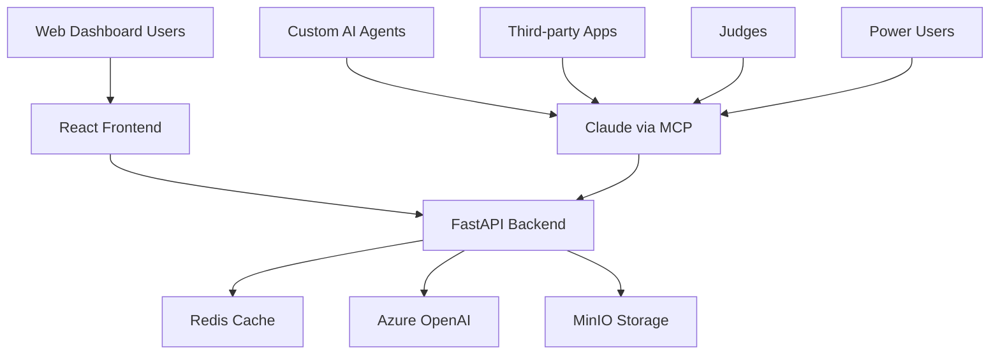

# MCP Strategy When Building a Frontend

## The New Reality

If we're building a frontend, then we have:
- **Traditional web app** (React/Vue + FastAPI backend)
- **Plus MCP tools** that provide the same functionality

This changes the value proposition entirely.

---

## Why Have Both Frontend AND MCP?

### 🎯 **Different User Types, Different Interfaces**

#### **Web App Users:**
- **Event Organizers**: Need dashboards, event management, analytics
- **Administrators**: Need user management, system configuration  
- **Teams/Participants**: Need registration, submission interfaces
- **Sponsors**: Need analytics dashboards, ROI reporting

#### **MCP Users:**  
- **Judges**: Prefer conversational scoring during live events
- **Power Users**: Want to combine our data with their own analysis
- **Integrators**: Building custom tools that need our AI capabilities

### 📊 **Use Case Distribution**

```
Web Frontend: 80% of functionality, 60% of users
- Event setup and management
- Registration and submissions  
- Results viewing and reporting
- Administrative functions

MCP Interface: 20% of functionality, 40% of usage intensity
- Live judging during events
- Ad-hoc analysis and comparison
- Integration with external tools
- Power user workflows
```

---

## The Dual-Interface Architecture

### 🏗️ **Technical Stack**



### 🔧 **Shared Backend Logic**

Both interfaces call the same business logic:

```python
# Shared service layer
class ScoringService:
    async def score_pitch(self, session_id, event_id, judge_id):
        # Core business logic
        return scoring_analysis

# Web API endpoint  
@app.post("/api/score-pitch")
async def score_pitch_api(request: ScoreRequest):
    return await scoring_service.score_pitch(...)

# MCP tool handler
async def score_complete_pitch(session_id, event_id, judge_id):
    return await scoring_service.score_pitch(...)
```

---

## When Users Choose Which Interface

### 🌐 **Web Frontend Scenarios**

#### **Event Setup Phase:**
```
Organizer workflow:
1. Create event → Web dashboard (form-heavy, complex setup)
2. Configure judges → Web interface (user management)  
3. Set scoring criteria → Web forms (structured input)
4. Monitor registrations → Web dashboard (data visualization)
```

#### **Post-Event Analysis:**
```
Sponsor workflow:
1. View ROI analytics → Web dashboard (charts, graphs)
2. Export team data → Web interface (bulk operations)
3. Generate reports → Web tools (formatted output)
```

### 🤖 **MCP Interface Scenarios**

#### **Live Judging:**
```
Judge workflow during hackathon:
Judge: "Score the team that just presented - session ABC"
Claude: "Analyzing Team FinTech's pitch... 87/100"
Judge: "How does this compare to other FinTech teams?"
Claude: "Ranks #2 of 4 FinTech teams today"
Judge: "Generate feedback for the team"
Claude: "Based on the scoring, here's constructive feedback..."
```

#### **Ad-hoc Analysis:**
```
Organizer during event:
Organizer: "Which teams are struggling with technical implementation?"
Claude: "5 teams scored below 6/10 on technical criteria"
Organizer: "Should we provide additional technical mentoring?"
Claude: "Yes, here are specific areas where teams need help..."
```

---

## The Value of Dual Interface

### ✅ **Why This Makes Sense**

#### 1. **Interface Optimization**
- **Web**: Optimized for data entry, visualization, administration
- **MCP**: Optimized for conversational analysis, live decision-making

#### 2. **User Experience Matching**
- **Structured tasks** → Web interface (forms, dashboards)
- **Analytical tasks** → Conversational interface (natural language)

#### 3. **Development Efficiency**
- **One backend** serves both interfaces
- **Shared business logic** reduces duplication
- **MCP tools** can be built faster than equivalent web pages

#### 4. **Market Coverage**
- **Web app** serves traditional SaaS customers
- **MCP interface** serves AI-first users and integrators

### 📈 **Business Model Benefits**

```
Revenue Streams:
1. SaaS subscriptions (web app users) - $50-500/month
2. Per-event pricing (web app) - $200-2000/event  
3. MCP API usage (external integrations) - $0.10-0.50/operation
4. Premium AI features (both interfaces) - $100-1000/month
```

---

## Implementation Strategy

### 🚀 **Development Phases**

#### **Phase 1: MVP Web App (8-12 weeks)**
```
Core web functionality:
- Event creation and management
- User registration and authentication  
- Basic judging interface (forms)
- Simple reporting dashboard
```

#### **Phase 2: MCP Enhancement (2-4 weeks)**
```
Add conversational interface:
- Live judging via Claude
- Ad-hoc analysis capabilities
- Integration-ready API layer
```

#### **Phase 3: Advanced Features (8-16 weeks)**
```
Enhanced capabilities for both interfaces:
- Real-time collaboration
- Advanced analytics
- Custom scoring models
- White-label options
```

### 🎯 **Feature Allocation Strategy**

#### **Web-Only Features:**
- Complex form-based data entry
- Administrative dashboards  
- Bulk data operations
- Visual report generation
- User management interfaces

#### **MCP-Only Features:**
- Conversational analysis
- Live event assistance
- Custom integrations
- Power user workflows
- AI-assisted decision making

#### **Dual-Interface Features:**
- Pitch scoring
- Results viewing
- Data retrieval
- Basic reporting

---

## Competitive Advantages

### 🛡️ **Why Competitors Can't Copy This Easily**

#### 1. **Interface Expertise**
- **Web expertise** is common
- **MCP expertise** is rare
- **Both done well** is unique

#### 2. **User Base Diversification**
- **Traditional users** stick with web interface
- **AI-forward users** prefer MCP interface  
- **Total addressable market** is larger

#### 3. **Integration Moat**
- **MCP interface** makes third-party integration easier
- **Network effects** from integrations benefit web users too
- **Ecosystem growth** strengthens core product

### 📊 **Market Positioning**

```
Against Traditional Platforms (Devpost, AngelHack):
- Better web interface AND conversational AI
- Serves both traditional and AI-first users

Against AI-Only Solutions:
- Full-featured web platform for comprehensive needs
- Professional interface for enterprise customers

Against Custom Solutions:
- Deploy web app quickly for traditional needs
- Add AI capabilities without rebuilding
```

---

## Resource Allocation

### 💻 **Development Team Focus**

```
Frontend Team (60% effort):
- React dashboard development
- User experience optimization  
- Mobile responsiveness
- Visual design and branding

Backend Team (30% effort):
- Business logic implementation
- API development for both interfaces
- Database optimization
- System integration

MCP Team (10% effort):
- Tool definition and optimization
- Integration support
- Conversational UX refinement
```

### 💰 **Budget Allocation**

```
Web Frontend Development: $120K-180K
- React application
- Dashboard and admin interfaces
- Mobile optimization
- Testing and QA

MCP Interface Development: $20K-40K  
- Tool registry enhancement
- Integration support
- Documentation and examples

Shared Backend: $80K-120K
- Business logic layer
- Database and infrastructure
- AI integration
- Security and scaling
```

---

## Success Metrics

### 📈 **Web App Metrics**
- User registration and retention
- Event creation and completion rates
- Dashboard engagement time
- Feature adoption rates

### 🤖 **MCP Metrics**
- Tool usage frequency
- Conversation completion rates
- Judge productivity improvement
- Third-party integration adoption

### 🎯 **Combined Success**
- **Total revenue** from both interfaces
- **User satisfaction** across interface types
- **Market share** in pitch competition space
- **Ecosystem growth** from integrations

---

## The Bottom Line

### 💡 **Why Dual Interface Works**

**Different tools for different jobs:**
- **Web interface** for structured, administrative work
- **MCP interface** for conversational, analytical work
- **One backend** serving both efficiently

### 🎯 **Strategic Value**

1. **Market Coverage**: Serve both traditional and AI-first users
2. **Revenue Diversification**: Multiple monetization streams  
3. **Competitive Moat**: Unique dual-interface approach
4. **Future-Proof**: Ready for AI-first and traditional markets

### 🚀 **Execution Reality**

**Build web app first** (primary market), **enhance with MCP** (differentiation and integration), **grow ecosystem** (long-term moat).

**MCP becomes the differentiator and integration layer, not the primary interface.**

---

**Result**: We get the benefits of a traditional SaaS platform PLUS the unique advantages of conversational AI and ecosystem integration capabilities.