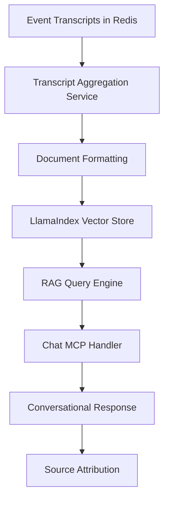

# Event Transcript Chat Plan

**Goal**: Enable AI-powered conversations with all recording transcripts from a particular event using RAG (Retrieval Augmented Generation).

## 🎯 Current State Analysis

### Recording Transcript Storage Structure
Based on the codebase analysis, here's how transcripts are currently stored:

#### Redis Key Pattern
```
event:{event_id}:session:{session_id}
```

#### Transcript Data Structure
```json
{
  "session_id": "uuid-string",
  "event_id": "event-123",
  "event_name": "Summer Hackathon 2024",
  "team_name": "Team Alpha",
  "pitch_title": "AI-powered Food Waste Reduction",
  "status": "completed",
  "final_transcript": {
    "segments_count": 15,
    "total_text": "Hi everyone, I'm presenting our AI solution...",
    "segments": [
      {
        "id": "segment-1",
        "text": "Hi everyone, I'm presenting our AI solution",
        "start_time": 0.0,
        "end_time": 3.2,
        "language": "en",
        "confidence": 0.95,
        "is_final": true
      }
    ],
    "audio_intelligence": {
      "sentiment": "positive",
      "emotions": ["confident", "excited"],
      "summary": "Team presents AI solution for food waste reduction",
      "key_points": ["AI technology", "sustainability focus", "market opportunity"]
    }
  },
  "created_at": "2024-01-15T10:00:00Z",
  "completed_at": "2024-01-15T10:05:30Z"
}
```

## 🏗️ Architecture Design

### 1. Transcript Aggregation Layer

```python
# New service: api/domains/chat/services/transcript_aggregation_service.py
class TranscriptAggregationService:
    async def get_all_event_transcripts(self, event_id: str) -> List[TranscriptDocument]
    async def format_for_indexing(self, transcripts: List[Dict]) -> List[Document]
    async def get_transcript_metadata(self, event_id: str) -> Dict[str, Any]
```

### 2. Enhanced Indexing Integration

```python
# Extension: api/domains/indexing/services/transcript_indexing_service.py
class TranscriptIndexingService:
    async def index_event_transcripts(self, event_id: str) -> IndexResult
    async def update_transcript_index(self, session_id: str) -> IndexResult
    async def query_transcripts(self, event_id: str, query: str) -> QueryResult
```

### 3. Chat Interface Enhancement

```python
# Extension: api/domains/chat/mcp/chat_mcp_tools.py
{
    "chat.with_event_transcripts": {
        "description": "Start conversation with all transcripts from an event",
        "parameters": {
            "event_id": str,
            "initial_question": Optional[str],
            "include_audio_intelligence": bool = True
        }
    },
    "chat.ask_transcripts": {
        "description": "Ask questions about event transcripts",
        "parameters": {
            "conversation_id": str,
            "question": str,
            "focus_sessions": Optional[List[str]]  # Filter to specific sessions
        }
    }
}
```

## 📊 Data Flow Architecture



### Key Components

1. **Transcript Retrieval**: Scan Redis for all `event:{event_id}:session:*` keys
2. **Document Preparation**: Convert transcript data to LlamaIndex Document format
3. **Vector Indexing**: Index documents with metadata (team_name, pitch_title, timestamps)
4. **Query Processing**: Use RAG to find relevant transcript segments
5. **Response Generation**: Generate contextual responses with source citations

## 🔧 Implementation Plan

### Phase 1: Transcript Aggregation (Current Focus)

#### 1.1 Create Transcript Aggregation Service
```python
# api/domains/chat/services/transcript_aggregation_service.py

from typing import Dict, List, Any, Optional
import json
import redis.asyncio as redis

class TranscriptDocument:
    """Structured transcript document for indexing."""
    def __init__(self, session_id: str, event_id: str, team_name: str, 
                 pitch_title: str, transcript_text: str, metadata: Dict):
        self.session_id = session_id
        self.event_id = event_id
        self.team_name = team_name
        self.pitch_title = pitch_title
        self.transcript_text = transcript_text
        self.metadata = metadata

class TranscriptAggregationService:
    """Service to aggregate transcripts from an event for chat."""
    
    async def get_all_event_transcripts(self, event_id: str) -> List[TranscriptDocument]:
        """Retrieve all transcripts for an event."""
        redis_client = redis.from_url("redis://redis:6379/0", decode_responses=True)
        transcripts = []
        
        # Scan for all session keys in the event
        async for key in redis_client.scan_iter(match=f"event:{event_id}:session:*"):
            session_data = await redis_client.get(key)
            if session_data:
                session_json = json.loads(session_data)
                if session_json.get("status") == "completed":
                    transcript_doc = self._create_transcript_document(session_json)
                    if transcript_doc:
                        transcripts.append(transcript_doc)
        
        return transcripts
    
    def _create_transcript_document(self, session_data: Dict) -> Optional[TranscriptDocument]:
        """Convert session data to transcript document."""
        final_transcript = session_data.get("final_transcript", {})
        transcript_text = final_transcript.get("total_text", "")
        
        if not transcript_text.strip():
            return None
        
        return TranscriptDocument(
            session_id=session_data["session_id"],
            event_id=session_data["event_id"],
            team_name=session_data["team_name"],
            pitch_title=session_data["pitch_title"],
            transcript_text=transcript_text,
            metadata={
                "segments_count": final_transcript.get("segments_count", 0),
                "audio_intelligence": final_transcript.get("audio_intelligence", {}),
                "created_at": session_data.get("created_at"),
                "completed_at": session_data.get("completed_at"),
                "duration_seconds": self._calculate_duration(final_transcript.get("segments", []))
            }
        )
```

#### 1.2 Extend Indexing Service for Transcripts
```python
# api/domains/indexing/services/transcript_indexing_service.py

from llama_index.core import Document
from ..services.document_indexing_service import DocumentIndexingService

class TranscriptIndexingService:
    """Service to index transcript documents for RAG."""
    
    def __init__(self, document_service: DocumentIndexingService):
        self.document_service = document_service
    
    async def index_event_transcripts(self, event_id: str) -> Dict[str, Any]:
        """Index all transcripts for an event."""
        from ...chat.services.transcript_aggregation_service import TranscriptAggregationService
        
        aggregation_service = TranscriptAggregationService()
        transcripts = await aggregation_service.get_all_event_transcripts(event_id)
        
        # Convert to LlamaIndex documents
        documents = []
        for transcript in transcripts:
            doc = Document(
                text=transcript.transcript_text,
                metadata={
                    "session_id": transcript.session_id,
                    "event_id": transcript.event_id,
                    "team_name": transcript.team_name,
                    "pitch_title": transcript.pitch_title,
                    "document_type": "pitch_transcript",
                    **transcript.metadata
                },
                doc_id=f"transcript_{transcript.session_id}"
            )
            documents.append(doc)
        
        # Index documents with event namespace
        namespace = f"event_{event_id}_transcripts"
        result = await self.document_service.index_documents(
            documents=documents,
            namespace=namespace,
            metadata_filters={"event_id": event_id}
        )
        
        return {
            "indexed_count": len(documents),
            "namespace": namespace,
            "event_id": event_id,
            "transcripts": [
                {
                    "session_id": t.session_id,
                    "team_name": t.team_name,
                    "pitch_title": t.pitch_title
                } for t in transcripts
            ],
            "index_result": result
        }
```

### Phase 2: Chat Interface Integration

#### 2.1 New MCP Tools for Transcript Chat
```python
# api/domains/chat/mcp/transcript_chat_tools.py

MCP_TRANSCRIPT_TOOLS = {
    "chat.with_event_transcripts": {
        "name": "chat.with_event_transcripts",
        "description": """
        Start an AI-powered conversation with all recording transcripts from an event.
        
        This tool indexes all completed pitch transcripts from the specified event
        and creates a conversation context where you can ask questions about:
        - Individual team pitches and ideas
        - Common themes across all presentations
        - Comparative analysis between teams
        - Technical approaches and solutions mentioned
        - Market opportunities discussed
        - Sponsor tool integrations referenced
        
        The AI will provide responses with source attribution showing which
        team/pitch the information came from.
        """,
        "inputSchema": {
            "type": "object",
            "properties": {
                "event_id": {
                    "type": "string",
                    "description": "Event ID containing the transcripts to chat with"
                },
                "initial_question": {
                    "type": "string",
                    "description": "Optional initial question to ask about the transcripts"
                },
                "include_audio_intelligence": {
                    "type": "boolean",
                    "description": "Include AI analysis data (sentiment, emotions, summaries) in context",
                    "default": True
                },
                "focus_areas": {
                    "type": "array",
                    "items": {"type": "string"},
                    "description": "Optional focus areas: 'technical', 'market', 'tools', 'presentation'"
                }
            },
            "required": ["event_id"]
        },
        "handler": "start_transcript_conversation"
    },
    
    "chat.ask_transcripts": {
        "name": "chat.ask_transcripts", 
        "description": """
        Ask a question within an existing transcript conversation.
        
        Use this to continue a conversation started with chat.with_event_transcripts.
        The AI will search through all event transcripts to find relevant information
        and provide contextual answers with proper source attribution.
        """,
        "inputSchema": {
            "type": "object",
            "properties": {
                "conversation_id": {
                    "type": "string",
                    "description": "Conversation ID from chat.with_event_transcripts"
                },
                "question": {
                    "type": "string", 
                    "description": "Question to ask about the transcripts"
                },
                "focus_sessions": {
                    "type": "array",
                    "items": {"type": "string"},
                    "description": "Optional: Focus only on specific session IDs"
                }
            },
            "required": ["conversation_id", "question"]
        },
        "handler": "ask_transcript_question"
    }
}
```

#### 2.2 MCP Handler Implementation
```python
# Extension to api/domains/chat/mcp/chat_mcp_handler.py

async def start_transcript_conversation(
    self,
    event_id: str,
    initial_question: Optional[str] = None,
    include_audio_intelligence: bool = True,
    focus_areas: Optional[List[str]] = None
) -> Dict[str, Any]:
    """Start conversation with all transcripts from an event."""
    
    logger = get_logger("chat.transcript_conversation")
    
    try:
        # 1. Index all event transcripts
        from ...indexing.services.transcript_indexing_service import TranscriptIndexingService
        from ...indexing.services.document_indexing_service import document_indexing_service
        
        transcript_service = TranscriptIndexingService(document_indexing_service)
        index_result = await transcript_service.index_event_transcripts(event_id)
        
        if index_result["indexed_count"] == 0:
            return {
                "error": "No completed transcripts found for this event",
                "event_id": event_id,
                "available_sessions": []
            }
        
        # 2. Create conversation with transcript context
        conversation_result = await self.start_conversation(
            event_id=event_id,
            conversation_type="transcript_analysis",
            title=f"Chat with Event Transcripts - {event_id}",
            focus_areas=focus_areas,
            session_ids=[t["session_id"] for t in index_result["transcripts"]]
        )
        
        if not conversation_result.get("success"):
            return conversation_result
        
        # 3. Process initial question if provided
        response_data = {
            "conversation_id": conversation_result["conversation_id"],
            "event_id": event_id,
            "indexed_transcripts": index_result["transcripts"],
            "total_transcripts": index_result["indexed_count"],
            "namespace": index_result["namespace"],
            "ready_for_questions": True
        }
        
        if initial_question:
            # Ask the initial question
            answer_result = await self.ask_transcript_question(
                conversation_id=conversation_result["conversation_id"],
                question=initial_question
            )
            response_data["initial_response"] = answer_result
        else:
            response_data["message"] = f"Ready to chat with {index_result['indexed_count']} transcripts from this event. What would you like to know?"
        
        return response_data
        
    except Exception as e:
        logger.error(f"Failed to start transcript conversation: {str(e)}")
        return {
            "error": f"Failed to start transcript conversation: {str(e)}",
            "event_id": event_id
        }

async def ask_transcript_question(
    self,
    conversation_id: str, 
    question: str,
    focus_sessions: Optional[List[str]] = None
) -> Dict[str, Any]:
    """Ask a question about transcripts in an existing conversation."""
    
    try:
        # Get conversation context
        redis_client = await self.get_redis()
        conversation_key = None
        
        # Find conversation across all events
        async for key in redis_client.scan_iter(match="event:*:conversation:*"):
            if f":conversation:{conversation_id}" in key:
                conversation_key = key
                break
        
        if not conversation_key:
            return {"error": "Conversation not found", "conversation_id": conversation_id}
        
        conversation_data = json.loads(await redis_client.get(conversation_key))
        event_id = conversation_data["event_id"]
        
        # Query the indexed transcripts using RAG
        from ...indexing.services.llamaindex_service import llamaindex_service
        
        namespace = f"event_{event_id}_transcripts"
        query_filters = {"event_id": event_id}
        
        if focus_sessions:
            query_filters["session_id"] = focus_sessions
        
        rag_result = await llamaindex_service.query_with_context(
            query=question,
            namespace=namespace,
            metadata_filters=query_filters,
            max_sources=5
        )
        
        if not rag_result.get("success"):
            return {
                "error": "Failed to query transcripts",
                "conversation_id": conversation_id,
                "question": question
            }
        
        # Format response with source attribution
        response_text = rag_result["response"]
        sources = []
        
        for source in rag_result.get("sources", []):
            sources.append({
                "session_id": source.get("session_id"),
                "team_name": source.get("team_name"),
                "pitch_title": source.get("pitch_title"),
                "relevance_score": source.get("score", 0.0),
                "excerpt": source.get("text", "")[:200] + "..." if len(source.get("text", "")) > 200 else source.get("text", "")
            })
        
        return {
            "conversation_id": conversation_id,
            "question": question,
            "response": response_text,
            "sources": sources,
            "source_count": len(sources),
            "namespace": namespace,
            "success": True
        }
        
    except Exception as e:
        return {
            "error": f"Failed to ask transcript question: {str(e)}",
            "conversation_id": conversation_id,
            "question": question
        }
```

### Phase 3: Enhanced Features

#### 3.1 Advanced Query Capabilities
- **Team Comparison**: Compare pitches between specific teams
- **Theme Analysis**: Find common themes across all pitches
- **Technical Deep-Dive**: Focus on technical implementations
- **Market Analysis**: Analyze market opportunities mentioned
- **Sponsor Tool Usage**: Track which tools teams mentioned

#### 3.2 Audio Intelligence Integration
- Include sentiment analysis in context
- Leverage emotion detection for pitch analysis
- Use AI summaries for quick insights
- Incorporate key points extraction

## 🧪 Testing Strategy

### Test Data Setup
```python
# tests/integration/test_transcript_chat.py

async def test_transcript_chat_flow():
    """Test complete transcript chat workflow."""
    
    # 1. Setup: Create event with multiple completed sessions
    event_id = "test-event-123"
    session_ids = await setup_test_event_with_transcripts(event_id)
    
    # 2. Test: Start transcript conversation
    chat_result = await execute_mcp_tool("chat.with_event_transcripts", {
        "event_id": event_id,
        "initial_question": "What are the main themes across all pitches?"
    })
    
    assert chat_result["success"] == True
    assert chat_result["total_transcripts"] == len(session_ids)
    
    # 3. Test: Ask follow-up question
    follow_up = await execute_mcp_tool("chat.ask_transcripts", {
        "conversation_id": chat_result["conversation_id"],
        "question": "Which teams mentioned AI in their pitches?"
    })
    
    assert follow_up["success"] == True
    assert len(follow_up["sources"]) > 0
    
    # 4. Validate: Check source attribution
    for source in follow_up["sources"]:
        assert "team_name" in source
        assert "session_id" in source
        assert "relevance_score" in source
```

## 📈 Expected Outcomes

### User Experience
1. **Natural Conversations**: Chat naturally about all pitches from an event
2. **Source Attribution**: Always know which team/pitch information comes from  
3. **Comparative Analysis**: Easy comparison between different pitches
4. **Theme Discovery**: Discover patterns and themes across presentations

### Technical Benefits
1. **Event Isolation**: Proper multi-tenant data separation
2. **Efficient Indexing**: Fast similarity search across transcripts
3. **Real-time Updates**: New transcripts automatically available for chat
4. **Scalable Architecture**: Handles events with many pitch sessions

### Sample Queries Supported
- "What are the most innovative ideas from this hackathon?"
- "Which teams mentioned using OpenAI in their solution?"
- "Compare the technical approaches of Team Alpha and Team Beta"
- "What market problems are teams trying to solve?"
- "Which pitches had the most positive sentiment?"
- "Show me teams that integrated multiple sponsor tools"

## 🚀 Implementation Priority

1. **High Priority**: Basic transcript aggregation and indexing
2. **High Priority**: Simple chat interface with transcript context
3. **Medium Priority**: Advanced querying and source attribution
4. **Medium Priority**: Audio intelligence integration  
5. **Low Priority**: Advanced analytics and theme detection

This plan provides a complete solution for chatting with event transcripts while leveraging your existing infrastructure (Redis, LlamaIndex, Chat domain) and maintaining proper multi-tenant isolation.